# [第1話 创建仓库试试提交吧【连载】漫画 Git ～命令篇～](https://www.r-staffing.co.jp/engineer/entry/20190621_1)

[漫画・Git](https://www.r-staffing.co.jp/engineer/archive/category/%E3%83%9E%E3%83%B3%E3%82%AC%E3%83%BBGit) [连载・专栏](https://www.r-staffing.co.jp/engineer/archive/category/%E9%80%A3%E8%BC%89%E3%83%BB%E3%82%B3%E3%83%A9%E3%83%A0) [技能提升](https://www.r-staffing.co.jp/engineer/archive/category/%E3%82%B9%E3%82%AD%E3%83%AB%E3%82%A2%E3%83%83%E3%83%97)

 

 

Web开发与App开发职场不可或缺的版本管理系统「Git」。[4月的活动](https://www.r-staffing.co.jp/engineer/entry/20190531_1)上，已经跟大家讲过 Git 的基础了。这个连载专栏将以漫画的形式，讲解 Git命令行。

虽然有专用软件可以用鼠标点来点去，直观地操作 Git；但是也有些时候，用命令行才更为便利。这次，为了会用 GUI 操作 Git，但是不擅长命令行的各位，主角若叶酱将会实践简单的 Git 命令行操作。大家也一起来试着用用吧！

---
 

【作者】湊川 あいさん

自由职业者，网页设计师・漫画家・插画家。喜欢通过漫画与图解以易于理解的方式传播技术。著书『与若叶酱一起学 Git使用入门』『与若叶酱一起学 Google Analytics』『与若叶酱一起学 网页开发基础』『与运用酱一起学 系统运用的基础』正在发售之外，漫画 Git、漫画 Docker・漫画 Ruby・漫画 Scrapbox・漫画 LINE Clova 开发・漫画卫星数据活用 等领域全方位地展开活动。与 千代田まどか 的合作企划于 TECH PLAY Magazine 连载中。
  
[･Amazon作者页面](https://www.amazon.co.jp/l/B01N8OK2UW?_encoding=UTF8&redirectedFromKindleDbs=true&rfkd=1&shoppingPortalEnabled=true)

[･Twitter](https://twitter.com/llminatoll)

---

## GUI 与 CLI 的不同之处

大家平时是怎样操作电脑的？应该是使用鼠标键盘，像点击显示器上的图标呀、把文件拖拽到垃圾站丢弃之类的吧。这些便是 GUI(Graphics User Interface) 了。

相对的，只使用键盘对操作系统发送命令操作电脑，那就是 CLI(Command Line Interface) 了。说到程序员就很容易让人想到使用“黑色画面”的人呢。

▼CLI 示例：终端（Windows下叫命令提示符）

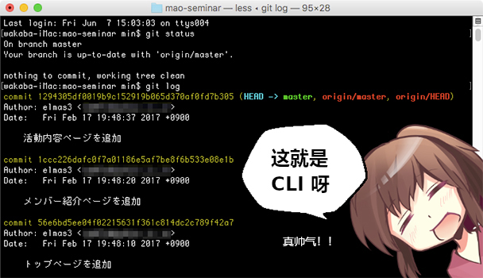

原本，早期的电脑就是只能使用键盘输入指令进行操作的。自 1980 年后，借由电脑处理能力提升，符合直觉的 GUI 操作开始普及。

Git 本来是 CLI 操作的软件，但随着广泛使用，不需要输入指令，直接用鼠标操作的 GUI 软件逐渐登场。例如 SourceTree、GitKraken、GitHub Desktop等等。

▼GUI 示例：SourceTree 的操作画面

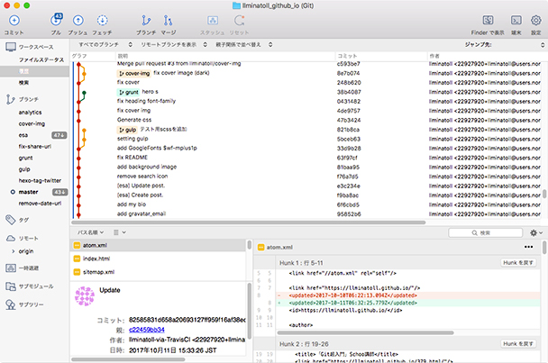

只是这么说的话，大家可能会想：”既然有操作简便的 GUI，没必要特意去使用面向高手的 CLI 吧“。然而，CLI 有各式各样的好处。

## CLI 的好处

作为例子，现在开始试着创建 Git 仓库吧。

如果是 GUI 的话，需要先打开软件，再按照 「新建仓库 → 作成创建本地仓库」的顺序点击鼠标。

相对的，CLI 的话只需要输入以下文字。

    $ git init

只要这样便能新建仓库。如何？很简单吧。

CLI 不仅仅是操作简单而已，也有 CLI 才能达成的操作。GUI 的目标是初学者也能轻松使用，虽然能简单地完成操作，但是删除了部分功能。

有许多在关键时刻可解燃眉之急的 Git 命令。这个系列连载通过介绍一个个的 Git 命令，让你就算发生「无法push了」「不小心删掉了还没 merge 的分支」之类的问题，也能从容应对。这样，你一定会变得更加喜欢 Git 吧。

## 用用看 CLI 吧

那么，我们立马来看看 CLI 的画面吧。

- Mac 的情况：
    Mac 的 CLI 叫做 「terminal」哦。点击 Launchpad 中的 「其他」，或者同时按下 <kbd>ctrl</kbd> + <kbd>space</kbd>，输入 「terminal」，便会出现需要的结果。

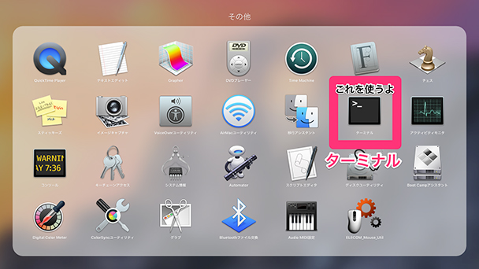  
  

- Windows的情况：
    Windows 的 CLI 叫做「命令提示符」。  
    同时按下 <kbd>win</kbd> + <kbd>r</kbd>，在打开的 「运行」窗口输入 cmd 再按下 <kbd>enter</kbd> 就行了。

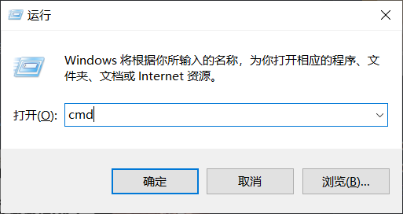

## 确认 Git 是否已经安装
输入

    $ git --version

显示出类似下方的文字，那便说明 Git 已经安装好了，紧接着来进行下一步吧。

    git version 2.19.0

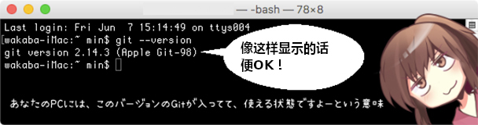

如果还没安装好 Git 的化，请访问 Git 官方网站，根据官方文档的指示进行安装。或者，请直接安装 SourceTree，SourceTree 的安装包中包含了 Git。

## 试试用命令行操作 Git 吧

### 基础命令行操作

***

首先，从最基本的命令开始，一点点熟悉 CLI 吧。输入 `pwd` 后按下 <kbd>enter</kbd>。啊，对了，起始的 `$` 符号是不用打的。

    $ pwd

只要三个字母就行了？p、w、d，回车……好了！

    $ pwd
    /Users/wakaba

哦哦！出现文字了！

这个是你现在所在的目录（Directory）哦。知道什么是目录吗？

类似文件夹结构的东西吧。是“我正在 Users 文件夹中，叫 wakaba 的文件夹里面”的意思。

正是如此。`pwd` 是 「Print Working Directory」的意思，也就是「显示我现在所在的地方」哟。

接下来，输入 `ls` 。（Windows 下的 cmd 的话，输入 `dir`）。   

    $ ls

    Desktop

    Documents

    Downloads

    Library

    Movies

    Music

    Pictures

    Public

    ……

很好！现在所在文件夹里，所有的东西都被显示出来了。顺带一提，`ls` 是 List Segments 的缩写。

进入到画面显示的，「Desktop」这个文件夹里。输入 `cd` 之后，接着输入想要移动到的文件夹名，就能进到文件夹里面了。

    $ cd Desktop

`cd` 是什么的缩写呀？

Change Directory 的缩写。很好记吧。

### 现在来创建目录（文件夹）吧

***

移到的「Desktop」之后，来新建练习用的文件夹吧。输入 `mkdir`，再接上想要的文件夹名，最后按下 <kbd>enter</kbd>。

那我想把新文件夹叫 lesson。

    $ mkdir lesson

  

 

哇，「Desktop」里，叫「lesson」的文件夹真的一下就出来了！一直以来都是用鼠标的，现在只要敲这么点文字就能完成！太棒了！

### 来创建仓库吧

***

那么，终于要到 Git 命令 的部分了。Git 命令的特征是，它是以「git」开头的。

▼移动到 lesson 文件夹

    $ cd lesson

▼创建

    $ git init

这样的话……

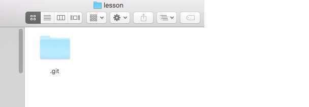  
  
仅需如此，仓库就创建完毕了！
  

对对，有叫 .git 的隐藏文件就说明有 Git 仓库呢。

### 创建测试用文件吧

***

虽然已经新建仓库了，但 lesson 文件夹里还是空空的呢。打开文本编辑器，随便弄点文件进去吧。

等下！难得都用上命令行了，这也用命令行来完成吧。

    $ echo “Hello Git” > sample.txt

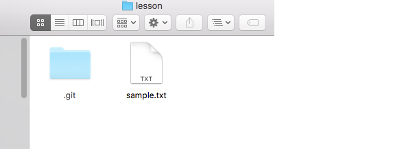

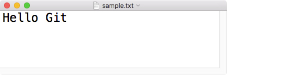

 

哇哇哇！有文件了，而且里面也有内容！CLI 真能干！

### 存进 Staging 区，然后提交吧

***

那么，现在把 sample.txt 记录到仓库里吧。首先使用 `git status` 命令，确认工作区的状态。

    $ git status

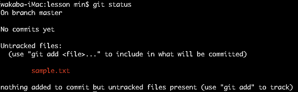

红色文字表示的是尚未存入 Staging 区的文件。

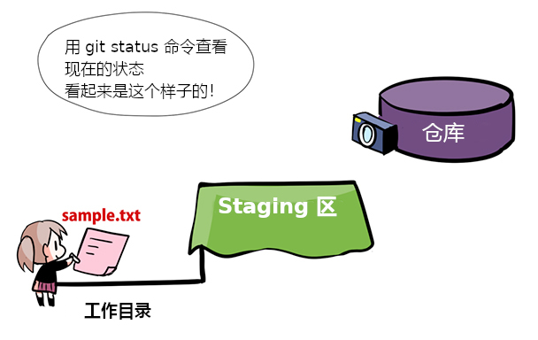

好了，来把 sample.txt 放上 Staging 区吧。

在我一直用的 GUI 上，都是勾选文件放到 Staging 区的。用命令行的话要怎么做呢？

其实 GUI 软件也只是在背后运行了 `git add` 命令而已。先输入 `git add`，然后在后面接上想放上 Staging 区 的文件名。

    $ git add \[文件名\]

git add sample.txt …… 好了。欸？什么都没发生啊？……

用 `git status` 确认一下状态看看。

    $ git status

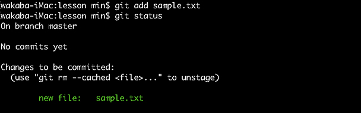  
  

哦？刚才红色的文件名变成绿色了！

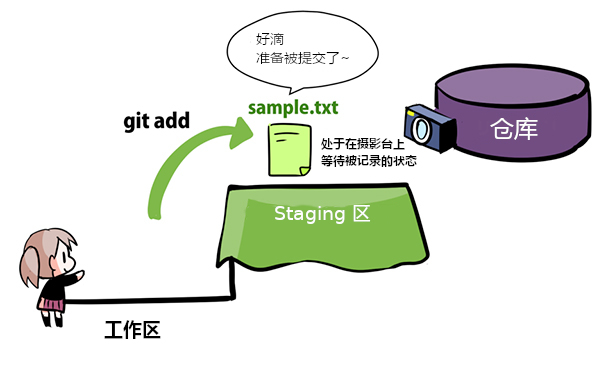

  

没错！变成绿色的文件是“现在已经在 Staging 区等着被提交了”的意思。

最后，终于要尝试提交了。把提交想象成对摄像台（Staging 区）上放着的东西咔嚓拍下来，放到相册（仓库）里。

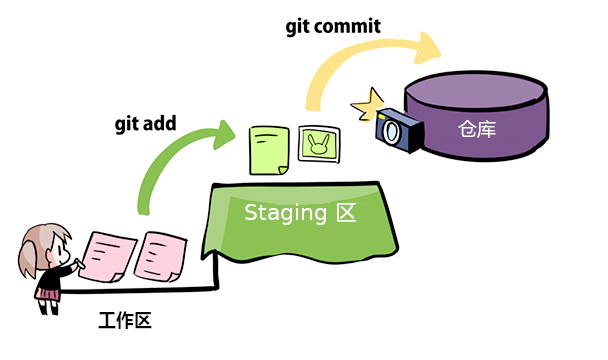

    $ git commit -m "在这里写提交信息"

提交信息要写在 `-m` 后面，用双引号包起来呢。`$ git commit -m "第一个提交"`……写好了！

## 查看下履历吧

很好！来确认下有没有成功提交吧。

    $ git log

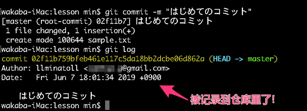  

 

哦哦！提交者、时间、注释都好好记录下来了！

虽然能看到历史记录挺不错的……但是，要是记录项目太多了，不显示完毕到最开始的提交，它不会结束啊！想停止显示的话要怎么办呀！

按下字母「q」啦！「q」代表 Quit（退出）的意思，记下来吧。

顺带一提，加上 `--graph` 执行命令的话，提交信息会以字符画的形式显示出来。因为现在只有一个提交，所以没啥区别，但是在有很多分支的仓库使用的话，还挺有趣的。

    $ git log --graph

▼CLI中以图形的形式查看提交

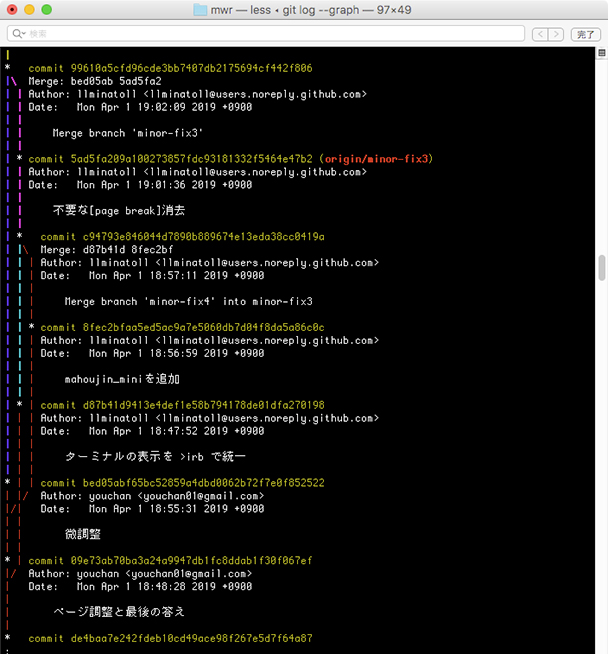  
  
因为还是 GUI 上看图形更为方便，所以也有人用 CLI 进行操作的同时，在旁边开着 GUI 进行确认工作。

至于哪种工作方式适合你，还请多多尝试吧。
  
▼SourceTree中以图形的形式查看提交

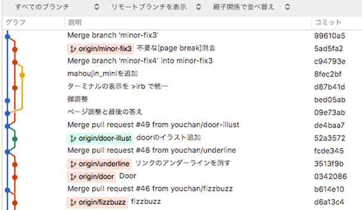  
  

## ★魔王教授 今天的小知识

***

在 CLI 中按下 <kbd>↑</kbd> 的话，可以显示出最近使用的命令，想再次执行的话非常方便！

▼使用 `↑` `↓` 键选择想使用的命令，按下 <kbd>enter</kbd> 执行

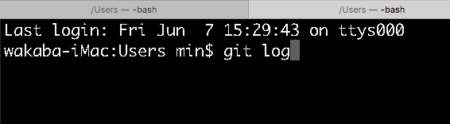

## 总结

我们来总结一下吧！

$ git init （创建仓库）

$ git status （确认状态）

$ git add （暂存）

$ git commit （提交）

$ git log （查看履历）

Git 还有许多其他的命令。下次将登场更加有用的命令。和若叶酱一起加油继续学习吧！  

▼登场角色介绍  
