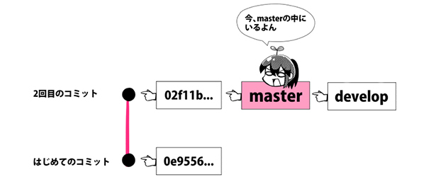

# [第2话 什么是分支？指针是什么意思？创建?确认?切换的方法【连载】漫画 Git ～命令篇～](https://www.r-staffing.co.jp/engineer/entry/20190719_1)

Web开发与App开发职场不可或缺的版本管理系统「Git」。虽然有专用软件可以用鼠标点来点去，直观地操作 Git；但是也有些时候，用命令行才更为便利。
  
[第1话](https://www.r-staffing.co.jp/engineer/entry/20190621_1?mls=i01_0001_20190719) 中学习了

    $ git init （创建仓库）
    $ git status （确认状态）
    $ git add （存入 Staging 区）
    $ git commit （提交）
    $ git log （查看履历）
  
这次第2话的目标是，让大家理解分支的概念，实践分支的创建、确认与切换。和主角若叶酱一同快乐地学习吧！
  
***

 

【作者】湊川 あいさん

自由职业者，网页设计师?漫画家?插画家。喜欢通过漫画与图解以易于理解的方式传播技术。著书『与若叶酱一起学 Git使用入门』『与若叶酱一起学 Google Analytics』『与若叶酱一起学 网页开发基础』『与运用酱一起学 系统运用的基础』正在发售之外，漫画 Git、漫画 Docker?漫画 Ruby?漫画 Scrapbox?漫画 LINE Clova 开发?漫画卫星数据活用 等领域全方位地展开活动。与 千代田まどか 的合作企划于 TECH PLAY Magazine 连载中。
 
[?Amazon作者页面](https://www.amazon.co.jp/l/B01N8OK2UW?_encoding=UTF8&redirectedFromKindleDbs=true&rfkd=1&shoppingPortalEnabled=true)  

[?Twitter账号](https://twitter.com/llminatoll)

***

### 什么是分支？不好好利用分支的话会变得这样

有很多人把分支比喻成平行世界，但不清楚实际的使用场景，很难理解这个比喻呢。那我们来看看，没有分支的情况会发生什么吧。

比如被要求给网页服务添加新功能。

这个时候不利用分支功能，直接在实际投入使用的环境上添加新功能，就会变成这样。

### 好好利用分支能变得这么方便！

那么，使用分支的话，会变得如何呢？

「master 分支」是初始分支。是使用 `$ git init` 创建仓库的时候一起新建的。先前只使用这个 master 分支，这个例子里我们要来新建叫「develop」的分支。

使用多条分支的话，不用影响现有的实际在生产环境中使用的源代码，可以安心地在其他分支上进行开发。甚至，开发用分支进行提交，测试用 URL 的内容也能随之自动更新。

等新功能稳定，已经可以实际添加进实际环境中，便可以将分支合并（Merge）回去了。

### 「分支实际上就是指针」是什么意思？

机会难得，来深入理解分支的机制吧。

在 [Git 官方文档](https://git-scm.com/book/ja/v1/Git-%E3%81%AE%E3%83%96%E3%83%A9%E3%83%B3%E3%83%81%E6%A9%9F%E8%83%BD-%E3%83%96%E3%83%A9%E3%83%B3%E3%83%81%E3%81%A8%E3%81%AF) 中说明道：分支不过是指向某个提交的轻量指针而已。

Git 的分支，具体上是怎样的东西呢？只要理解了这个，就能融会贯通之后的许多 Git 概念。

### 来揭晓分支的真身吧

欸！？

要进到仓库里吗？！

当然要进去了。

叫做「.git」的半透明文件夹就是仓库了。

打开[第1话](https://www.r-staffing.co.jp/engineer/entry/20190621_1)中创建的 lesson 文件吧。

它应该是这个状态。

赶紧来瞧瞧仓库里面的样子喽。

有一个叫「.git」的，半透明的隐藏文件夹在里面呢。

这玩意就是仓库了。双击进入。

（如果找不到 .git 文件夹，请将隐藏文件夹的显示设置为开启）

进入之后，按照 refs > heads 的顺序打开文件夹，应该能看见叫做 master 的文件。
这就是 master 分支的真身了。
那么，这个文件里有些什么内容呢？
用文本编辑器打开来看看吧。

master 这个名字，意味着它是最初的分支吧！
我来打开看看……这，咦？就这么点东西？

没错，分支的内容惊人的简单呢。

只写着一排英文与数字呀……
02f11b759bfeb461e117c5da18bb2dcbe06d862a  
这是什么密码吗？

哈哈哈，这列文字是「提交 ID」。
也被成为「提交哈希值」。

说起来，上一次，好像看过这种长~长的一串文字！
利用 `git log` 查看提交历史的时候，这种文字和提交信息一起出现了。

正是如此。
基于提交生成的数据被成为「提交对象」。
Git 会为每个提交对象分配 40 个字符长度的 ID。
而这就是提交 ID 了。

哦哦？……！感觉有趣起来了。
那，也就是说？……
ほほう…！？なんだか面白くなってきたぞ。  
で、つまりどういうこと？

也就是说，分支仅仅是「标识出特定的提交 ID」而已。

欸欸~！
简单到令人失望呀！

### 来探秘提交对象的内部吧

「提交指向了其他提交」究竟是什么意思？来实际看看吧。

依照下方的操作，在相同的练习用文件夹中里再创建一个提交，这样查看提交记录的话，应该能看到 2 个提交。

1\. sample.txtに何かしら変更を加える  
2\. $ git add sample.txt  
3\. $ git commit -m “2回目のコミット”  
4\. $ git log

第二次的提交被记录下来了呢。能看到这样的提交历史就 OK 了。

接下来，第二次的提交对象记录了些什么东西呢？用下面的命令来看看吧。

	$ git cat-file -p 0e9556

▼显示结果：这就是提交对象

	treeee290b48b356d721ae54d1edb03993802cc98bad8  
	parentt02f11b759bfeb461e117c5da18bb2dcbe06d862a  
	authorrllminatolll<XXX@mail.com>l1562052826 +0900  
	committerrllminatolll<XXX@mail.com>l1562052826 +0900

注意看「parent」的部分！那里写着02f11b…。

啊！这个提交 ID 不就是上一个的吗。
第二个提交指向着第一个提交呢！

▼现在的状态

将提交相互连接的，就是记录在 parent(父级）中的信息。除去最初的提交，所有的提交对象都记有 parent 信息。

▼看看最初的提交（初始提交），可以看到没有 parent 的信息，记录的只有 tree、author、committer。

	$ git cat-file -p 02f11b759  
  
	treee4576025551dd04fafbcb36bd7e1e7814018d11ea  
	authorrllminatolll<XXX@mail.com>11559898094 +0900  
	committerrllminatolll<XXX@mail.com>11559898094 +0900

★提交 ID 是基于什么生成的呢？
  
提交 ID（哈希值）实际上是根据提交对象的 byte大小 与 内容计算得来的。因此，只要提交者、提交时间、父级提交、tree 不相同，生成的提交 ID 也会不同。
  
作为证据，就算和若叶酱提交了相同的内容，提交 ID 也会不一样。想更加深入了解哈希值请阅读这篇文章。
  
▼Git 的提交 ID 哈希值是基于什么生成的？
[https://tech.mercari.com/entry/2016/02/08/173000](https://tech.mercari.com/entry/2016/02/08/173000)

### 确认现有的分支吧

	$ git branch

这样现存的分支会被全部列出来。由于现阶段只有 master 这一条分支，所以只会显示出它这一条。

### 新建分支吧

	$ git branch \[分支名\]

这是新建分支的命令。输入 `$ git branch develop`。之后再使用 `$ git branch` 查看现有分支，能看到这样的显示。

	  develop
	* master

顺带一提，这里的「*」は简单来说就是「你现在在这个分支里哦」的意思。

▼ 现在的状态

### 移动到想要去的分支上吧

	$ git checkout \[分支名\]

那么，从 master 分支切换到 develop 分支上吧。
输入 `$ git checkout develop` ，就能看到所有的分支，并能确认到现在正在 develop 分支上。

▼现在的状态

测试一下，保持在 develop 分支的状态，向 sample.txt 中随意添加些文字，然后提交。
試しに、developブランチの中にいる状態で、sample.txtに何かしら文字を追加して新たにコミットを作ってみてください。

developブランチの指差しだけが動き、masterは2回目のコミットを指差したままです。こういう仕組みのおかげで、masterブランチに影響を与えることなく、開発用ブランチにコミットを積み重ねていくことができるのです。

▼现在的状态

★知道了超方便！`git checkout` 的小知识

「-b」选项

	$ git checkout -b \[分支名\]

可以在新建分支的同时，切换到新分支上。

「-f」选项

	$ git checkout -f \[分支名\]

强制切换分支。（要注意会丢失没有提交的信息）

### 总结

那么，到现在我们已经学习了分支的概念，并且掌握了

	$ git branch （创建分支）
	$ git checkout (切换分支）

的使用方法。

Git 中还有许多许多的命令，
下次将会解说用来合并分支的命令「merge」!

▼登场角色介绍

