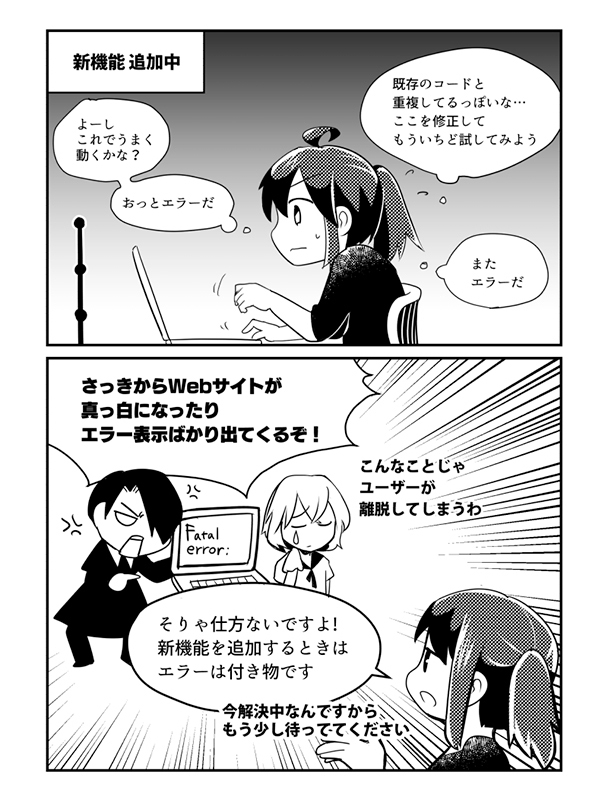
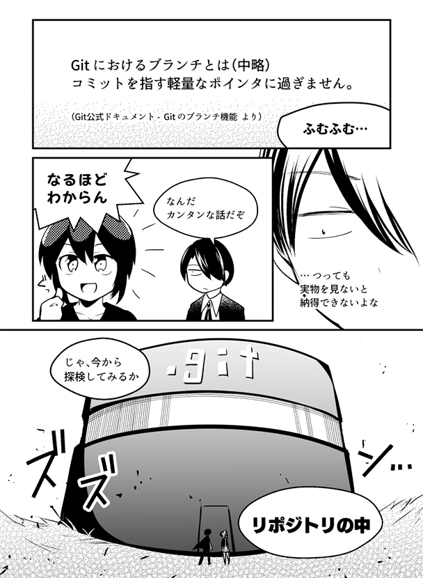
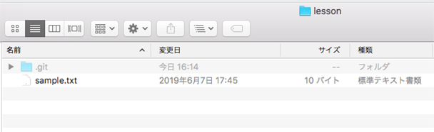
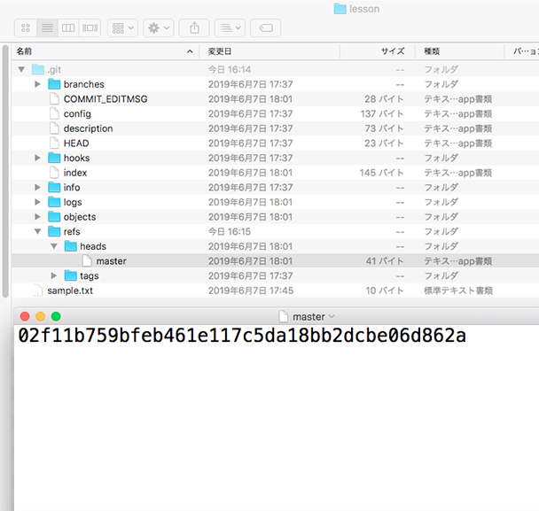
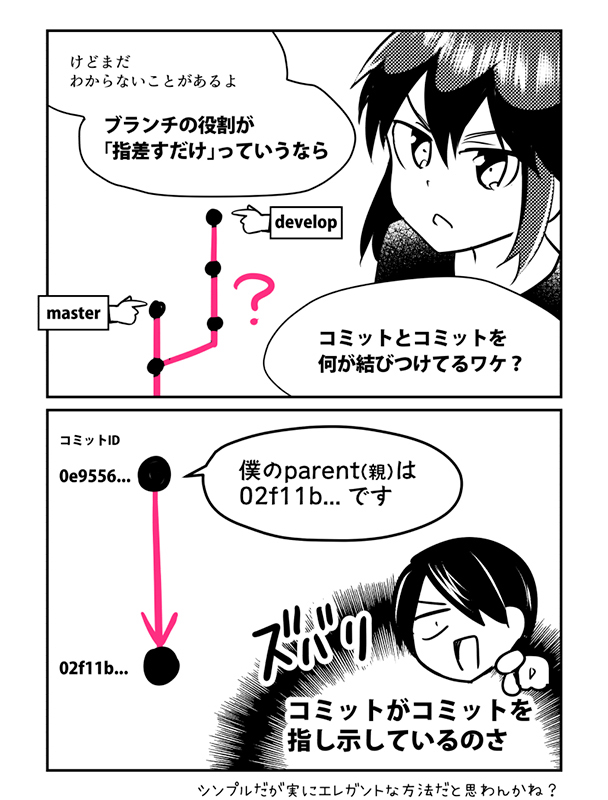
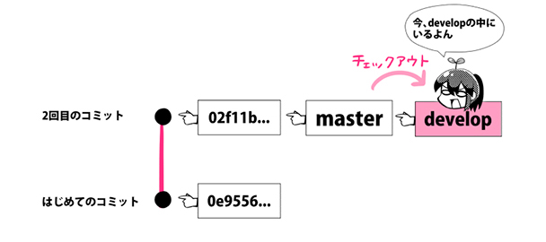
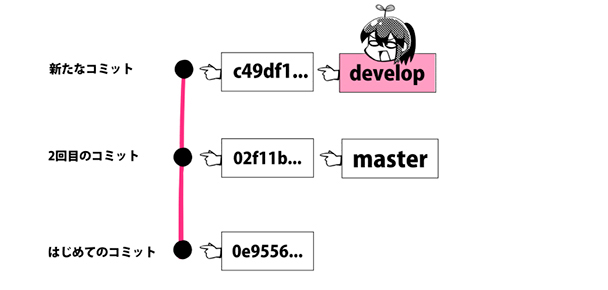

# [第2话 什么是分支？指针是什么意思？创建・确认・切换的方法【连载】漫画 Git ～命令篇～](https://www.r-staffing.co.jp/engineer/entry/20190719_1)

Web开发与App开发职场不可或缺的版本管理系统「Git」。虽然有专用软件可以用鼠标点来点去，直观地操作 Git；但是也有些时候，用命令行才更为便利。
  
[第1话](https://www.r-staffing.co.jp/engineer/entry/20190621_1?mls=i01_0001_20190719) 中学习了

    $ git init （创建仓库）
    $ git status （确认状态）
    $ git add （存入 Staging 区）
    $ git commit （提交）
    $ git log （查看履历）
  
这次第2话的目标是，让大家理解分支的概念，实践分支的创建、确认与切换。和主角若叶酱一同快乐地学习吧！
  
***

 

【作者】湊川 あいさん

自由职业者，网页设计师・漫画家・插画家。喜欢通过漫画与图解以易于理解的方式传播技术。著书『与若叶酱一起学 Git使用入门』『与若叶酱一起学 Google Analytics』『与若叶酱一起学 网页开发基础』『与运用酱一起学 系统运用的基础』正在发售之外，漫画 Git、漫画 Docker・漫画 Ruby・漫画 Scrapbox・漫画 LINE Clova 开发・漫画卫星数据活用 等领域全方位地展开活动。与 千代田まどか 的合作企划于 TECH PLAY Magazine 连载中。
 
[･Amazon著者ページ](https://www.amazon.co.jp/l/B01N8OK2UW?_encoding=UTF8&redirectedFromKindleDbs=true&rfkd=1&shoppingPortalEnabled=true)  

[･Twitterアカウント](https://twitter.com/llminatoll)

***

### ブランチとは？ブランチを活用しないとこんなことに

「ブランチとは並行世界である」と例えられることが多いですが、実際の活用場面がわからないとイメージできませんよね。そこで、ブランチを活用しないとき・活用したときの違いをマンガで見てみましょう。

たとえば「Webサービスに新機能を追加してほしい」と言われたとします。

そんなときにブランチを活用せず、本番環境に新機能を直接付けていくと、こんなことになってしまいます。

### ブランチを活用するとこんなに便利！

では、ブランチを活用するとどうなるでしょうか？

「masterブランチ」というのは最初から存在するブランチです。$ git init でリポジトリを作ったときから存在しています。先ほどはmasterブランチひとつしか使っていませんでしたが、この例では「developブランチ」というものを新しく作りました。

複数のブランチを活用すると、本番環境に使われているソースコードに影響を与えず、安心して別のブランチで開発を進めることができます。開発用のブランチのコミットが更新されたら、テスト用URLの内容も自動で更新することも可能です。

新機能が安定し「もう本番に公開しても大丈夫だね」とわかってから、満を持して本番環境にマージ（統合）するというわけです。

### 「ブランチとはポインタである」ってどういう意味？

せっかくなので、ブランチについてもう一段深く理解してみましょう。

[Gitの公式ドキュメント](https://git-scm.com/book/ja/v1/Git-%E3%81%AE%E3%83%96%E3%83%A9%E3%83%B3%E3%83%81%E6%A9%9F%E8%83%BD-%E3%83%96%E3%83%A9%E3%83%B3%E3%83%81%E3%81%A8%E3%81%AF) によると

ブランチとは（中略）コミットを指す軽量なポインタに過ぎません

と説明されています。

Gitにおけるポインタとは、具体的にどのようなものなのでしょうか？これを理解していると、今後Gitの概念をより理解しやすくなりますよ。

### ブランチの正体を解き明かそう

え！？  
リポジトリの中って入れるの！？

もちろん入れるとも。  
「.git」という名前の、半透明のフォルダがリポジトリだ。

[第1話](https://www.r-staffing.co.jp/engineer/entry/20190621_1) で作ったlessonファイルを開こう。  
こんな状態になっているはずだ。

さっそくリポジトリの中身を見てみるぞ。  
「.git」という名前の、半透明の隠しフォルダがあるな。  
こいつがリポジトリだ。ダブルクリックして開いてくれたまえ。  
（.gitフォルダが確認できない場合は、隠しファイルの表示設定をONにしましょう）

その中にある refs > heads の順にフォルダを開いていくと、masterというファイルがあるはずだ。  
これがmasterブランチの正体だ。  
さて、このファイルには何が書いてあるだろうか？  
テキストエディタで開いてみたまえ。

masterっていうのは、最初からあるブランチの名前だよね！  
開いてみると…  
アレッ？たったこれだけ？

そう、ブランチの中身は驚くほどシンプルなんだ。

英数字の羅列が書いてあるけど…  
02f11b759bfeb461e117c5da18bb2dcbe06d862a  
これは何かの暗号？

HAHAHA、この文字列は「コミットID」だ。  
「コミットハッシュ値」とも呼ばれているな。

そういえば前回、この長～い文字列、見た気がする！  
コミットの履歴を見ようと $ git log を実行したときに、コミットメッセージと一緒に表示されてたわ。

いかにも。  
コミットによって生成されたデータのことを「コミットオブジェクト」と呼ぶ。  
Gitはひとつのコミットオブジェクトに対して、40文字のIDを割り当ててくれる。  
これがコミットIDだ。

ほほう…！？なんだか面白くなってきたぞ。  
で、つまりどういうこと？

つまり、ブランチは「ただ単に特定のコミットIDを指差しているだけ」なんだ。

ええ～っ！  
拍子抜けするほどカンタンな話じゃん！

### コミットオブジェクトの中身をのぞいてみよう

コミットが「コミットを指し示している」とはどういうことでしょうか？実際に見てみましょう。

同じ練習用フォルダの中で、もうひとつコミットを作り、コミットログには計2つのコミットがある状態にしてください。操作方法は次の通りです。

1\. sample.txtに何かしら変更を加える  
2\. $ git add sample.txt  
3\. $ git commit -m “2回目のコミット”  
4\. $ git log

2回目のコミットが記録できましたね。コミット履歴がこのようになっていればOKです。

さて、このとき2回目のコミットオブジェクトには何が記録されているでしょうか？次のコマンドで見てみましょう。

$ git cat-file -p 0e9556

▼ 表示結果：これがコミットオブジェクトだ

treeee290b48b356d721ae54d1edb03993802cc98bad8  
parentt02f11b759bfeb461e117c5da18bb2dcbe06d862a  
authorrllminatolll<XXX@mail.com>l1562052826 +0900  
committerrllminatolll<XXX@mail.com>l1562052826 +0900

「parent」の部分に注目です！02f11b…と書かれています。

あっ！ このコミットIDは、ひとつ前のものだよね。  
2つ目のコミットが、1つ目のコミットを指差してるってワケだ！

▼ 今の状態

コミットとコミットを結びつけているのは、このparent（親）の記載です。一番初めのコミットを除き、すべてのコミットオブジェクトには必ずparentが記載されています。

▼ 試しに、一番初めのコミット（イニシャルコミット）のコミットオブジェクトも見てみましょう。記載があるのはtree、author、committerの3つだけ。parentの記載がないのが見てとれます。

$ git cat-file -p 02f11b759  
  
treee4576025551dd04fafbcb36bd7e1e7814018d11ea  
authorrllminatolll<XXX@mail.com>11559898094 +0900  
committerrllminatolll<XXX@mail.com>11559898094 +0900

★コミットIDは何を元に作られているの？  
  
コミットID（コミットハッシュ値）は、実はこのコミットオブジェクトのバイト数と中身を使い、計算されて作られています。よって、コミットした人の名前やコミットした時間、指し示すparent、treeが違えばコミットハッシュ値も違うものになります。  
  
その証拠に、同じ内容をコミットしていても、あなたの練習用リポジトリとわかばちゃんのコミットIDは違うはずです。コミットハッシュ値についてもっと深く知りたい方は、こちらの記事が詳しいのでおすすめです。  
  
▼ Gitのコミットハッシュ値は何を元にどうやって生成されているのか  
  
[https://tech.mercari.com/entry/2016/02/08/173000](https://tech.mercari.com/entry/2016/02/08/173000)

### 今存在するブランチを確認しよう

$ git branch

今、存在するブランチの一覧が表示されます。現段階では、masterブランチしかないので、\* master と表示されると思います。

### ブランチを作ろう

$ git branch \[ブランチ名\]

新しいブランチを作るコマンドです。$ git branch develop と打ち込みましょう。その後 $ git branch でブランチ一覧を見ると、このように表示されます。

  develop
\* master

ちなみにこのアスタリスクマーク「\*」は、簡単に言うと「あなたは今そのブランチの中にいますよ」という意味です。

▼ 今の状態

### 任意のブランチへ移動しよう

$ git checkout \[ブランチ名\]

さて、masterブランチからdevelopブランチに切り替えてみましょう。

$ git checkout develop と打ち込み、その後 $ git branch でブランチ一覧を見ると、今自分はdevelopブランチの中にいることが見てとれます。

▼ 今の状態

試しに、developブランチの中にいる状態で、sample.txtに何かしら文字を追加して新たにコミットを作ってみてください。

developブランチの指差しだけが動き、masterは2回目のコミットを指差したままです。こういう仕組みのおかげで、masterブランチに影響を与えることなく、開発用ブランチにコミットを積み重ねていくことができるのです。

▼ 今の状態

★知っていると便利！ git checkout コマンドの豆知識  
  

「-b」オプション

  

$ git checkout -b \[ブランチ名\]

  
  

ブランチの作成とチェックアウトを同時に行えます。

  
  

「-f」オプション

  

$ git checkout -f \[ブランチ名\]

  
  
ブランチを強制的に切り替えることができます。  
（コミットしていない作業データは消えるので注意）

### まとめ

さて、ここまでで、ブランチの概念の習得と合わせて

$ git branch（ブランチを作る）
$ git checkout （チェックアウトする）

が使えるようになりましたね！

Gitにはまだまだたくさんのコマンドがあります。  
次回は、ブランチとブランチを併合する「マージ」について解説します！  
  

▼登場キャラクター紹介  
